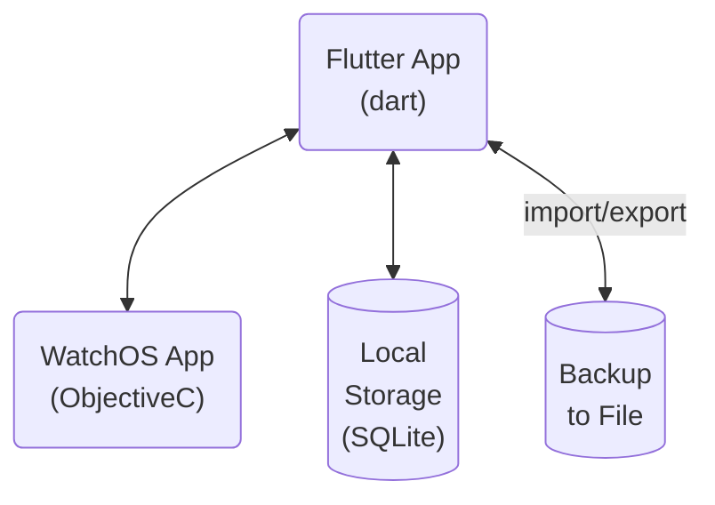

### Architecture Diagram:

```mermaid
graph TD;
    mobile_app("Flutter App<br>(dart)")
    watch_app("WatchOS App<br>(ObjectiveC)")
    local_storage[("Local<br>Storage<br>(SQLite)")]
    backup[("Backup<br>to File")]

    mobile_app<-->watch_app
    mobile_app<-->local_storage
    mobile_app<--"import/export"-->backup
```